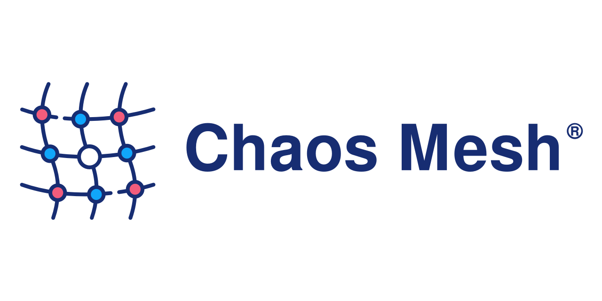
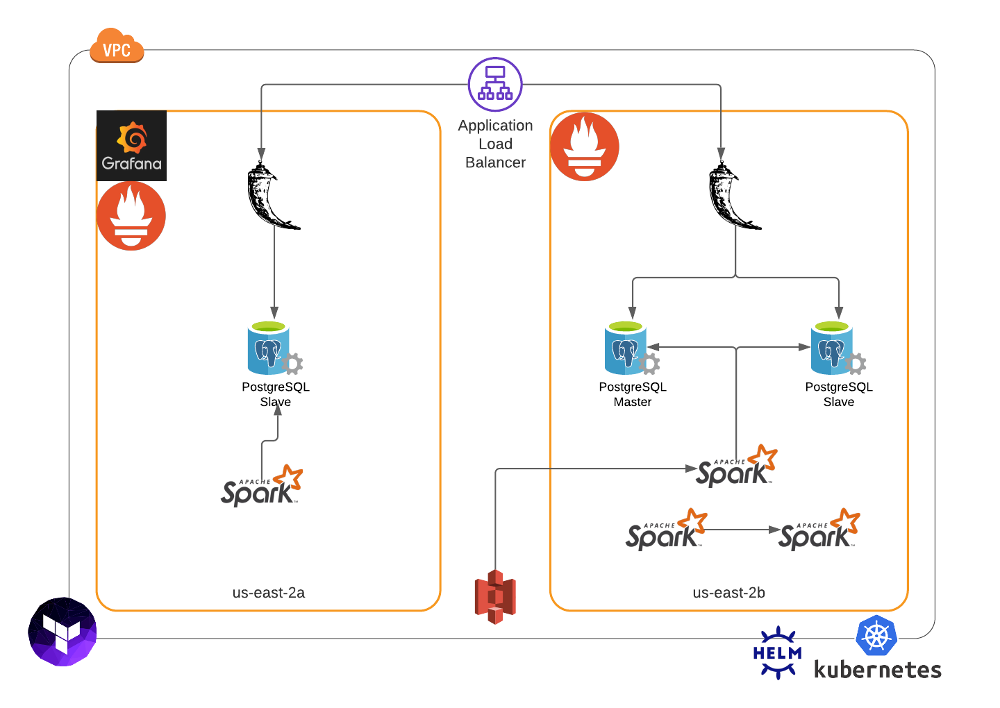

# Chaos Control

# Problem

The overview of my project brings awareness to the negative impacts of system downtime.  Every minute counts when you have an application relying heavily on data centers.  The average cost of system downtime *"across industries was valued at approximately **$5,600 per minute**."*[[a]](https://www.evolven.com/blog/downtime-outages-and-failures-understanding-their-true-costs.html) According to a 2019 survey, 25 percent of global enterprise companies *"reported the average hourly downtime cost of their servers as being between **$301,000 - 400,000 USD.**"*[[b]](https://www.statista.com/statistics/753938/worldwide-enterprise-server-hourly-downtime-cost/)

### In what ways can system downtime impact a company?
  1. A loss in productivity
  2. A loss in opportunity
  3. Brand Damage
  4. Data Loss

# Solution
The repercussions of outages are critical for companies as more and more businesses are moving online.  Some main causes of system downtime are **system overload, equipment failure, and software failure.** [[a]](https://www.techrepublic.com/article/10-common-causes-of-downtime-and-how-to-avoid-them/)[[b]](https://www.vxchnge.com/blog/common-causes-of-server-downtime)  I implement **chaos engineering** principles to focus in on these common causes of outages to find holes in the architecture and decrease outages. 

# System Architecture
### Data Pipeline
I am leveraging an existing data engineering project called *Scale*, which is a music recommendation engine that recommends songs depending on the instruments in a song.  For more information about the data pipeline, visit the project [here](https://github.com/mothas/insight-music-project).

    

* **AWS S3**: All the MIDI files were hosted on S3. 
* **Spark**: Apache Spark was used for 2 purposes:
  * Extract list of *instruments* used in a song. This was done using Python Package `pretty_midi`.
  * Computer Similarity Score for every song pairs using `MinHash`.
* **PostgreSQL**: Used to store the results
	* The following tables were created based on Spark job:
  * `filename_instrument`: Stores a row for every instrument used in a song.
  * `filepair_similarity_score`: Has the *similarity-score* for every song pair.

### DevOps Architecture
The existing data pipeline has been containerized using *docker*.  *Terraform* was used to automate the foundation infrastructure. *Helm* and *Kubernetes* was used to organize the data pipeline into clusters.  *Grafana* and *Prometheus* was used for monitoring.  

    
    

    

