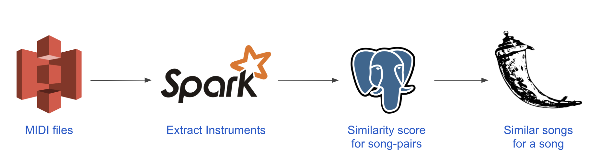

# Chaos Control

# Problem

The overview of my project brings awareness to the negative impacts of system downtime.  Every minute counts when you have an application relying heavily on data centers.  The average cost of system downtime *"across industries was valued at approximately **$5,600 per minute**."*<sup>[[a]](https://www.evolven.com/blog/downtime-outages-and-failures-understanding-their-true-costs.html)</sup> According to a 2019 survey, 25 percent of global enterprise companies *"reported the average hourly downtime cost of their servers as being between **$301,000 - 400,000 USD.**"*<sup>[[b]](https://www.statista.com/statistics/753938/worldwide-enterprise-server-hourly-downtime-cost/)</sup>

### In what ways can system downtime impact a company?
  1. A loss in productivity
  2. A loss in opportunity
  3. Brand Damage
  4. Data Loss


# Solution
The repercussions of outages are critical for companies as more and more businesses are moving online.  Some main causes of system downtime are **system overload, equipment failure, and software failure.** <sup>[[a]](https://www.techrepublic.com/article/10-common-causes-of-downtime-and-how-to-avoid-them/)[[b]](https://www.vxchnge.com/blog/common-causes-of-server-downtime)</sup>  I implement **chaos engineering** principles to focus in on these common causes of outages to find holes in the architecture and decrease outages. 

# System Architecture
### Data Pipeline
I am leveraging an existing data engineering project called *Scale*, which is a music recommendation engine that recommends songs depending on the instruments in a song.  For more information about the data pipeline, visit the project [here](https://github.com/mothas/insight-music-project).

<p align="center">
    
</p>

* **AWS S3**: All the MIDI files were hosted on S3. 
* **Spark**: Apache Spark was used for 2 purposes:
  * Extract list of *instruments* used in a song. This was done using Python Package `pretty_midi`.
  * Computer Similarity Score for every song pairs using `MinHash`.
* **PostgreSQL**: Used to store the results
	* The following tables were created based on Spark job:
  * `filename_instrument`: Stores a row for every instrument used in a song.
  * `filepair_similarity_score`: Has the *similarity-score* for every song pair.


### DevOps Architecture
The existing data pipeline has been containerized using **docker**.  **Terraform** was used to automate the foundation infrastructure.  **Helm** and **Kubernetes** was used to organize the data pipeline into clusters.  **Grafana** and **Prometheus** was used for monitoring.   As for my chaos testing tools, I used [**Gremlin**](https://www.gremlin.com) and [**Chaos Mesh**](https://github.com/chaos-mesh/chaos-mesh)

<div align="left">
    
    
</div>

<p align="center">
    
</p>


# Chaos Testing
The way I'll be running my experiments will be a series of 3 steps.  
1. Steady State
   - What does your infrastructure look like before you test it?
2. Hypothesis
   - What do you think will happen when you test it?
3. Run Experiment & Observe
   - What happened and how can you improve it?


### Experiment I: Application Layer Failure Injection

#### Part 1: Steady State
For this experiment, my blast radius will be a **PostgreSQL** and **Flask** pod.  
I used **pgbench** which is a tool to benchmark my PostgeSQL performance.

By using pgbench my steady state results for my PostgreSQL pod are:
   - **100** concurrent database connections
   - **2** worker threads
   - latency average: **270.735** ms
   - **369.364 t/s** <sup><sub>(transactions per second)</sub></sup>
   - **22216** transactions processed
   
Looking at the PostgreSQL screenshot, you can see the CPU performance spike from the pgbench.  The Flask screenshot shows a constant pod up and running.  
<p align="center">
    
    
</p>

#### Part 2: Hypothesis
  - Since I'm destroying a PostgreSQL and Flask pod, I'm assuming the it will accordingly failover to the other zone however the latency will increase.
  - The pod will self-heal but the application performance will suffer.

#### Part 3: Run Experiment & Observe
The numbers below are for the **PostgreSQL** using pgbench *before* the pod was killed and *after* the pod was killed.  The table demonstrates that the other PostgreSQL pod were able to handle the load but the performance still suffered.  If this was in a larger scale and using bigger datasets, the pods would not be able to keep up and the performance will significantly deteriorate. 

Latency Average:
| Before | After | 
| :---: | :---: |
| 270.735 ms | 305.143 ms |

Transactions Per Sec: <sup><sub>(higher is better)</sub></sup>
| Before | After | 
| :---: | :---: |
| 369.364 t/s | 327.715 t/s |

Transactions Processed:
| Before | After | 
| :---: | :---: |
| 22216 | 19710 |


The screenshot below is the PostgreSQL pod getting destroyed and suddenly being unavailable. It took around 1 minute and 30 seconds for the pod to self heal.  
<p align="center">
    
</p>

This picture represents the Flask pod on how it takes around 30 seconds to start back up.  
<p align="center">
   
</p>

Ultimately, from these results my aim is to minimize the time it takes for both PostgreSQL and Flask pods self heal.  I also want to increase the amount of concurrent users the application can endure.  Luckily, you're able to scale according to demand and minimize the self-heal time using Kubernetes' horizontal pod autoscaler.  Using the `kubectl` command or a yaml file.  

For example, if you want to scale the flask pod using the `kubectl` command perform these steps:
```
# Step 1: Check which pod you want to autoscale
kubectl get pod --all-namespaces

# Step 2: Autoscale!
kubectl autoscale deployment scale-app -n dev --cpu-percent=80 --min=1 --max=10
    # This scales the pod "scale-app" inside the namespace dev
    # If ever the pod exceeds 80% of cpu usage, Kubernetes will autoscale it.

# Step 3: If you want to check the autoscaling
kubectl get hpa --all-namespaces
```
